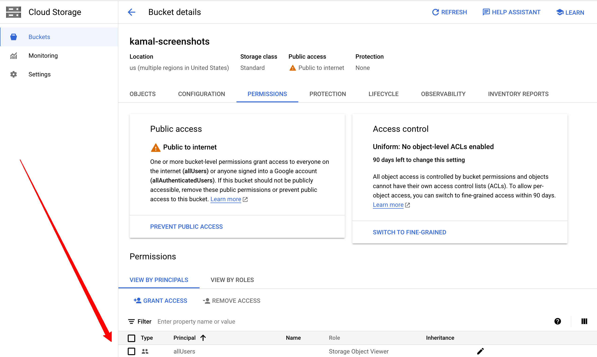

# clipboard-to-url

A CLI tool that uploads images, videos, or files from your clipboard to Google Cloud Storage and provides a shareable URL

## Usage

(1) Copy an image, path to an image, or path to a video

(2) Run `python clipboard_to_url.py`

(3) Paste the URL

## Setup

(1) Create a bucket https://cloud.google.com/storage/docs/creating-buckets

(2) Make the bucket public by granting the `Storage Object Viewer` role to the `allUsers` principal (see [this](https://cloud.google.com/storage/docs/access-control/making-data-public) guide for more details). This allows anyone on the internet to _view_ files that are in this bucket, but only you can upload files to this bucket. When all is said and done, it should look like this:

(3) Copy `.env.example` to `.env` and fill out the values

(4) Create a python virtual environment `python -m venv env`

(5) Install dependencies `pip install wheel && pip install -r requirements.txt`
